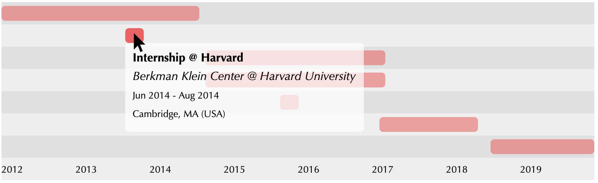

# gantt-js

A simple (and incomplete) library for creating gantt-style interactive visualizations (e.g. for timelines).

The library has been mainly created to display resume-related activities (e.g. work experience, education), so some assumptions will be made based on that.

The source code is written in TypeScript, an obvious choice for those interested in not losing their mental health over Javascript.

The library generates an SVG image for the gantt visualization and displays additional information when hovering over the bars of the chart.



## Files structure

* ```src/```: contains all useful TypeScript files. A `entry.ts` file will have to be defined, with all the activities to be displayed on the timeline
* `dist/`: contains the output (JS) file. Since the project uses webpack, a single js file will be produced (`bundle.js`). This file can then be included anywhere
* `index.html`: a simple example of html code that embeds the gantt visualization (more on that in the **How to use** section)

## How to use

First, install all necessary stuff with `npm`:
```
$ npm install
```
Then, after having created a valid `entries.ts` file (see `entries.dummy.ts` for reference), use webpack to build the bundle js file:
```
npx webpack
```
You will find the output file in `dist/bundle.js`.

To include the gantt visualization in an html document, you will need 3 things:
1. CSS: use the CSS defined in `index.html`
2. JS: include the script in `dist/bundle.js`
3. HTML: define an empty div element with id `container` (`<div id="container"></div>`)

In `index.html` you will find a sample file containing these three things.

## Customizations
In `drawTimeline()` (found in `src/timeline.ts`), you will find a set of constants you may change to customize the way the gantt is displayed. 

Ideally, in the near future, some additional documentation will be added to describe how each constant affects the displayed chart (though most parameters are self-explanatory, or can be figured out by reading the portions of the code).